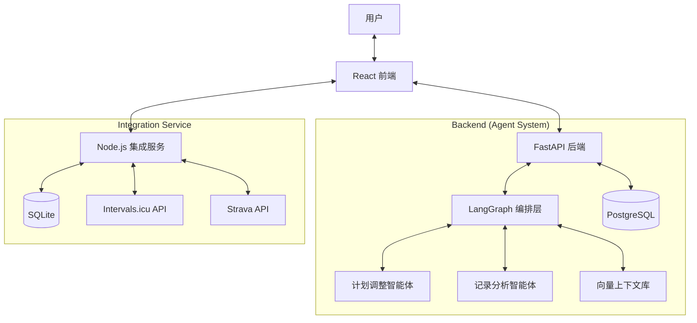

# MyCoach - AI 私人健身教练

基于 AI 智能体（AI Agents）的个人健身教练应用，为用户提供科学、周期化、个性化的训练计划和运动分析。

## 架构概览



## 功能特性

- **智能计划生成**：基于用户问卷和 AI 算法，生成 4 周周期化（Macro/Micro）训练计划。
- **多智能体协作**：
    - **Agent A (Plan Agent)**：负责理解用户意图，精准修改训练计划。
    - **Agent B (Analysis Agent)**：负责分析单次或周期运动记录，提供专业洞察。
    - **智能联动**：基于 Agent B 的分析建议，Agent A 可自动执行计划调整。
- **RAG 上下文管理**：通过向量数据库存储和检索用户的历史对话、训练偏好和计划变更，使 AI 教练更懂你。
- **自然语言对话**：支持通过聊天方式灵活、细粒度地修改训练计划（如：把明天的跑步换成游泳）。
- **多平台数据同步**：
    - **Intervals.icu**：深度集成，支持运动记录同步及 Webhook 实时通知。
    - **Strava**：直接导入跑步、骑行、游泳等活动数据。
- **专业数据追踪**：记录 RPE（感知运动强度）、心率、配速、功率等专业训练指标。

## 技术栈

### 前端
- **React 18** + **TypeScript**
- **Vite**：构建工具
- **Zustand**：状态管理
- **SCSS**：样式方案

### 后端
- **FastAPI**：Python 高性能 Web 框架
- **LangGraph**：AI 智能体工作流编排
- **SQLAlchemy (Async)**：数据库 ORM
- **PostgreSQL**：主数据存储
- **AI Provider**：适配 OpenAI, DeepSeek, Claude 等主流大模型

### 数据集成服务
- **Node.js** + **Express**
- **SQLite**：轻量级本地同步状态存储
- **Intervals.icu / Strava API**：第三方运动平台集成

### 部署
- **Docker** + **Docker Compose**
- **Nginx**：反向代理与静态资源服务

## 快速开始

### 1. 克隆项目

```bash
git clone <repository-url>
cd myCoach
```

### 2. 配置环境变量

```bash
cp env.example .env
# 编辑 .env 文件，填入你的 AI API Key 和第三方平台凭证
```

### 3. 使用 Docker Compose 启动

```bash
docker compose up -d
```

服务端口映射：
- 前端：[http://localhost:3000](http://localhost:3000)
- 后端 API：[http://localhost:8000](http://localhost:8000)
- 集成服务：[http://localhost:3001](http://localhost:3001)

## 项目结构

```
myCoach/
├── frontend/                 # React 前端应用
│   ├── src/
│   │   ├── services/         # API 及第三方客户端 (Strava/Intervals)
│   │   ├── store/            # Zustand 状态管理
│   │   ├── pages/            # 业务页面 (计划/记录/设置)
│   │   └── constants/        # 问卷配置及字段定义
├── backend/                  # FastAPI 后端 (AI 核心)
│   ├── app/
│   │   ├── api/              # REST API 路由
│   │   ├── services/
│   │   │   ├── agents/       # LangGraph 智能体逻辑 (Graph/State/Agents)
│   │   │   ├── context/      # RAG 上下文管理器 (Vector Store/Embedding)
│   │   │   └── ai/           # 大模型服务适配器
│   │   ├── models/           # SQLAlchemy 模型
│   │   └── prompts/          # AI 提示词模板
├── server/                   # Node.js 集成服务 (中转站)
│   ├── routes/               # Intervals/Strava/Webhook 路由
│   ├── services/             # 业务逻辑处理
│   └── db/                   # SQLite 数据库配置
└── doc/                      # 项目文档
```

## API 端点概览

### 训练计划 (`/api/plans`)
- `POST /generate`: 生成新计划
- `GET /`: 获取计划列表
- `POST /{id}/chat`: AI 对话调整计划
- `POST /{id}/update`: 基于记录自动分析并建议调整
- `POST /{id}/confirm-update`: 确认并应用分析建议
- `POST /{id}/next-cycle`: 生成下一阶段详细内容

### 运动记录 (`/api/records`)
- `POST /`: 创建/同步记录
- `GET /`: 获取记录列表
- `POST /{id}/analyze`: AI 智能分析单次运动

## 贡献

欢迎提交 Issue 或 Pull Request 来完善这个 AI 教练！

## 许可证

[MIT License](LICENSE)
