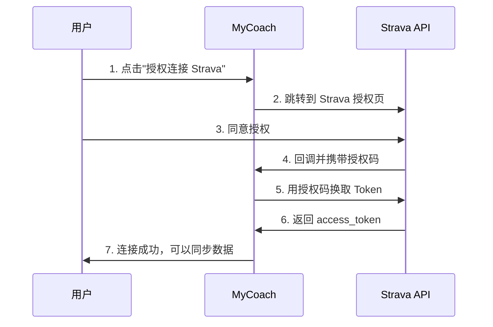

# API Server - 数据同步服务配置

本文档介绍 MyCoach 的 Node.js API Server（server/）的配置和使用方法，包括 Intervals.icu 和 Strava 数据同步功能。

## 服务概述

API Server 是一个 Node.js/Express 服务，负责：
- 与第三方运动平台（Intervals.icu、Strava）进行数据同步
- 管理 OAuth 认证流程
- 存储同步配置和记录

服务默认运行在 `http://localhost:3001`。

---

## Intervals.icu 数据同步配置

MyCoach 支持从 [Intervals.icu](https://intervals.icu) 自动同步运动数据。Intervals.icu 是一个强大的训练分析平台，可以从 Garmin、Strava、Wahoo 等设备/平台自动导入数据。

### 获取 Intervals.icu API Key

1. 登录 [Intervals.icu](https://intervals.icu)
2. 进入 **Settings** → **Developer Settings**
3. 点击 **Create API Key** 生成一个新的 API Key
4. 复制生成的 API Key（格式类似 `xxxxxxxx-xxxx-xxxx-xxxx-xxxxxxxxxxxx`）

### 方式一：通过 Web UI 配置（推荐）

1. 访问 MyCoach 应用：http://localhost:3000
2. 进入 **设置** 页面
3. 在 **Intervals.icu 数据同步** 区域填写：
   - **API Key**：粘贴你的 Intervals.icu API Key
   - **Athlete ID**（可选）：留空则自动获取
   - **Webhook Secret**（可选）：用于实时同步验证
4. 点击 **连接 Intervals.icu** 按钮
5. 连接成功后，可以选择同步天数并点击 **立即同步**

### 方式二：通过环境变量配置

在 `.env` 文件中添加：

```bash
# Intervals.icu 配置
INTERVALS_API_KEY=your_intervals_api_key
INTERVALS_ATHLETE_ID=i12345    # 可选，留空则自动获取
INTERVALS_WEBHOOK_SECRET=your_secret   # 可选，用于实时同步
```

### 配置实时同步（Webhook）

如果希望在 Intervals.icu 上有新活动时自动同步到 MyCoach：

1. 在 Intervals.icu 进入 **Settings** → **Developer Settings**
2. 在 **Webhooks** 区域添加新的 Webhook：
   - **URL**: `https://your-domain.com/webhook/intervals`
   - **Secret**: 自定义一个密钥字符串
3. 在 MyCoach 中配置相同的 Webhook Secret

> **注意**：Webhook 需要公网可访问的 URL。本地开发时可使用 ngrok 等工具。

### 支持的运动类型

从 Intervals.icu 同步的运动将自动映射到 MyCoach 的运动类型：

| Intervals.icu | MyCoach |
|---------------|---------|
| Ride, VirtualRide | 骑行 |
| Run, VirtualRun | 跑步 |
| Swim | 游泳 |
| WeightTraining, Workout | 力量训练 |
| Yoga | 瑜伽 |
| HIIT | HIIT |
| 其他 | 其他 |

### Intervals API 端点

| 方法 | 路径 | 描述 |
|------|------|------|
| GET | /api/intervals/config | 获取配置状态 |
| PUT | /api/intervals/config | 保存配置 |
| DELETE | /api/intervals/config | 断开连接 |
| POST | /api/intervals/test | 测试连接 |
| POST | /api/intervals/sync | 手动同步活动 |
| GET | /api/intervals/records | 获取已同步记录 |
| POST | /webhook/intervals | Webhook 接收端点 |

### 安全说明

- **API Key 仅存储在服务器端**：不会暴露给前端浏览器
- **Webhook 验证**：支持 Secret 验证，防止伪造请求
- **日志脱敏**：API Key 不会出现在日志中
- **HTTPS**：生产环境建议配置 SSL/TLS

---

## Strava 数据同步配置

MyCoach 支持直接从 [Strava](https://www.strava.com) 同步运动数据。Strava 是全球最大的运动社交平台，支持跑步、骑行、游泳等多种运动类型。

### 创建 Strava 开发者应用

1. 登录 [Strava](https://www.strava.com)
2. 访问 [Strava API 设置页](https://www.strava.com/settings/api)
3. 填写应用信息：
   - **Application Name**：MyCoach（或你喜欢的名称）
   - **Category**：Training
   - **Club**：留空
   - **Website**：http://localhost:3000
   - **Authorization Callback Domain**：`localhost`（开发环境）或你的域名
4. 创建成功后，获取：
   - **Client ID**
   - **Client Secret**

### 通过 Web UI 配置（推荐）

1. 访问 MyCoach 应用：http://localhost:3000
2. 进入 **设置** 页面
3. 在 **Strava 数据同步** 区域：
   - 输入 **Client ID** 和 **Client Secret**
   - 点击 **保存配置**
4. 配置保存后，点击 **授权连接 Strava**
5. 在 Strava 授权页面点击 **Authorize** 同意授权
6. 授权成功后会自动跳转回设置页面
7. 连接成功后，选择同步天数并点击 **立即同步**

### 支持的运动类型

从 Strava 同步的运动将自动映射到 MyCoach 的运动类型：

| Strava | MyCoach |
|--------|---------|
| Ride, VirtualRide, GravelRide, MountainBikeRide | 骑行 |
| Run, VirtualRun, TrailRun | 跑步 |
| Swim | 游泳 |
| WeightTraining, Workout | 力量训练 |
| Yoga | 瑜伽 |
| HIIT, Crossfit | HIIT |
| 其他 | 其他 |

### Strava API 端点

| 方法 | 路径 | 描述 |
|------|------|------|
| GET | /api/strava/config | 获取配置状态 |
| PUT | /api/strava/config | 保存 Client ID/Secret |
| DELETE | /api/strava/config | 断开连接 |
| GET | /api/strava/auth-url | 获取 OAuth 授权 URL |
| GET | /api/strava/callback | OAuth 回调处理 |
| POST | /api/strava/test | 测试连接 |
| POST | /api/strava/sync | 手动同步活动 |
| GET | /api/strava/records | 获取已同步记录 |

### OAuth 流程说明

Strava 使用 OAuth 2.0 授权码模式：



### 安全说明

- **Client Secret 仅存储在服务器端**：不会暴露给前端浏览器
- **Token 自动刷新**：access_token 过期时自动使用 refresh_token 续期
- **OAuth 安全**：使用标准 OAuth 2.0 授权码模式
- **日志脱敏**：敏感信息不会出现在日志中

