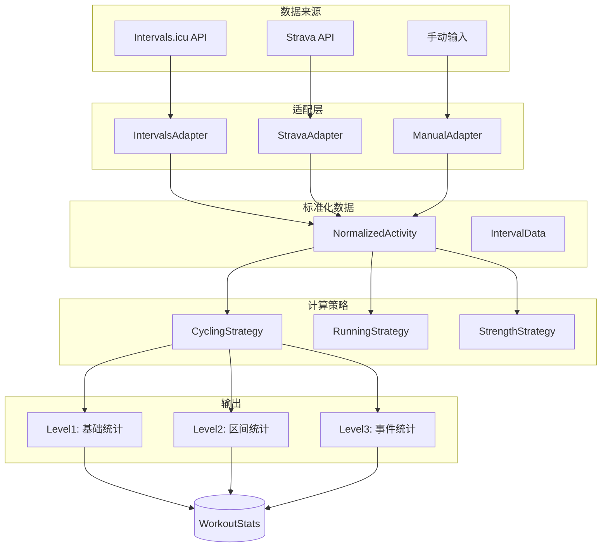
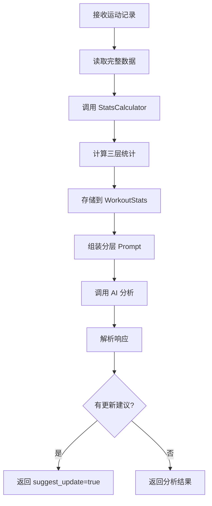

# 运动数据统计模块设计文档

## 概述

`analytics` 模块负责从原始运动数据中提取三层统计信息，支持多种数据来源和运动类型。

---

## 模块架构



---

## 目录结构

```
backend/app/services/analytics/
├── __init__.py          # 模块导出
├── adapter.py           # 数据源适配器
├── calculator.py        # 统计计算引擎
├── store.py             # 数据库存取
└── strategies/
    ├── __init__.py
    ├── base.py          # 策略基类
    ├── cycling.py       # 骑行策略
    ├── running.py       # 跑步策略
    └── strength.py      # 力量训练策略
```

---

## 核心数据结构

### NormalizedActivity

统一的活动数据结构，所有适配器输出此格式：

```python
@dataclass
class NormalizedActivity:
    activity_type: str      # cycling/running/strength/other
    duration_seconds: int
    summary: Dict[str, Any] # avg_hr, max_hr, avg_power, etc.
    intervals: List[IntervalData]
    source: str             # intervals/strava/manual
    source_id: Optional[str]
    timestamp: Optional[str]
    raw_data: Dict[str, Any]
```

### IntervalData

区间/分段数据：

```python
@dataclass
class IntervalData:
    index: int
    interval_type: str      # threshold/vo2max/recovery/work
    duration_seconds: int
    avg_power: Optional[float]
    avg_hr: Optional[float]
    max_hr: Optional[float]
    avg_pace: Optional[float]
    target_power: Optional[str]
    rpe: Optional[float]
    notes: Optional[str]
```

---

## 三层统计信息

### Level 1: 基础统计

| 指标 | 说明 | 计算方法 |
|------|------|----------|
| `duration_min` | 运动时长（分钟） | 直接换算 |
| `avg_hr` | 平均心率 | 数据点均值 |
| `max_hr` | 最大心率 | 数据点最大值 |
| `avg_power` | 平均功率（骑行） | 数据点均值 |
| `normalized_power` | 标准化功率 | (∑P⁴/n)^0.25 的30秒滚动 |
| `power_hr_ratio` | 功率心率比 | avg_power / avg_hr |
| `hr_drift_pct` | 心率漂移 | (后半段HR - 前半段HR) / 前半段 × 100 |
| `tss` | 训练压力得分 | (duration × NP × IF) / (FTP × 36) |
| `rpe_reported` | 主观疲劳度 | 用户输入 |
| `completion_rate` | 完成率 | 实际 / 计划 × 100 |

### Level 2: 区间统计

```json
{
  "intervals": [
    {
      "type": "threshold",
      "duration_sec": 300,
      "avg_power": 220,
      "avg_hr": 165,
      "target_power": "Z4"
    }
  ],
  "power_drop_last_interval_pct": 7.2,
  "interval_type_counts": {"threshold": 3, "recovery": 2}
}
```

### Level 3: 事件统计

```json
{
  "events": [
    {
      "timestamp_min": 18,
      "event": "heart_rate_drift_start",
      "hr_at_event": 158,
      "power_at_event": 230,
      "hr_increase_pct": 8.5
    },
    {
      "timestamp_min": 41,
      "event": "power_drop",
      "drop_pct": 9.5,
      "power_at_event": 200
    }
  ]
}
```

---

## 数据库模型

```python
class WorkoutStats(Base):
    __tablename__ = "workout_stats"
    
    id: UUID (PK)
    record_id: UUID (FK -> workout_records.id, UNIQUE)
    activity_type: String
    computed_at: DateTime
    level1_stats: JSONB
    level2_stats: JSONB
    level3_stats: JSONB
    data_source: String
    data_quality_score: Float
```

---

## 使用示例

### 基本使用

```python
from app.services.analytics import StatsCalculator

calculator = StatsCalculator(db)

# 计算并存储统计
stats = await calculator.compute_and_store(
    record_id="xxx",
    raw_data={"type": "cycling", "duration": 60, "rpe": 7},
    source="manual"
)

# 获取或计算（带缓存）
stats = await calculator.get_or_compute(record_id, raw_data)

# 仅计算不存储
result = calculator.compute_only(raw_data)
```

### 在 AnalyzeRecordAction 中使用

统计模块已集成到 `AnalyzeRecordAction`，会自动：

1. 在分析前计算统计信息
2. 将统计信息格式化后注入到 AI 提示词中
3. 缓存统计结果避免重复计算

---

## 运动类型策略

### CyclingStrategy

- 主要指标：功率
- 特有计算：NP、TSS、功率/心率比
- 事件检测：功率下降、心率漂移

### RunningStrategy

- 主要指标：配速、心率
- 特有计算：配速分析、心率区间分布
- 事件检测：配速下降、心率漂移

### StrengthStrategy

- 主要指标：RPE、组数
- 特有计算：每运动平均RPE
- 事件检测：RPE骤升

---

## 数据质量评分

`data_quality_score` (0-1) 基于数据完整性：

| 条件 | 分值 |
|------|------|
| 有时长 | +0.3 |
| 有心率数据 | +0.2 |
| 有功率数据 | +0.2 |
| 有区间数据 | +0.2 |
| 有RPE | +0.1 |

---

## 运动记录分析流程

### 完整工作流



### Prompt 组装结构

```
┌─────────────────────────────────────────┐
│  SYSTEM PROMPT                          │
│  ├─ AI 教练人设 (SYSTEM_PROMPT)         │
│  └─ 分析框架 (PERFORMANCE_ANALYSIS_PROMPT)│
│      ├─ Level 1 分析指引                │
│      ├─ Level 2 分析指引                │
│      ├─ Level 3 事件解读                │
│      └─ 输出格式要求                    │
├─────────────────────────────────────────┤
│  相关训练历史 (可选上下文)               │
└─────────────────────────────────────────┘

┌─────────────────────────────────────────┐
│  USER PROMPT (分层统计数据)              │
│  ├─ 运动类型 & 数据质量                  │
│  ├─ Level 1: 基础统计                   │
│  │   └─ 时长/心率/功率/TSS/RPE等        │
│  ├─ Level 2: 区间统计                   │
│  │   └─ 区间表格 + 衰减分析             │
│  └─ Level 3: 事件统计                   │
│      └─ 心率漂移/功率下降/RPE骤升        │
└─────────────────────────────────────────┘
```

### 分层 Prompt 示例

```markdown
## 运动记录分析数据

**运动类型:** 骑行
**数据质量:** 90.0% (数据充分)

---
### Level 1: 基础统计

- **时长:** 60.0 分钟
- **平均心率:** 145 bpm (最大: 172 bpm)
- **平均功率:** 180 W (标准化: 195 W)
- **功率心率比:** 1.24
- **心率漂移:** 5.2% (需关注)
- **训练压力得分 (TSS):** 65.0 (中等)
- **主观疲劳度 (RPE):** 7/10

---
### Level 2: 区间统计

**区间数量:** 5

| 区间 | 类型 | 时长 | 功率/配速 | 心率 |
|------|------|------|-----------|------|
| 1 | warmup | 10m | 120W | 125 |
| 2 | threshold | 8m | 220W | 165 |
| 3 | recovery | 5m | 100W | 135 |
| 4 | threshold | 8m | 218W | 168 |
| 5 | threshold | 8m | 205W | 172 |

**末尾区间功率下降:** 7.2% (需关注)

---
### Level 3: 事件统计

**检测到 2 个事件:**

⚠️ **心率漂移开始** @ 18.0min
   - 心率: 158 bpm, 上升幅度: 8.5%

📉 **功率下降** @ 41.0min
   - 下降幅度: 9.5%, 当前功率: 200W

---

请基于以上三层统计数据，对本次训练进行专业分析。
```

---

## 与 AI 分析集成

### 新的分析提示词框架

`PERFORMANCE_ANALYSIS_PROMPT` 已更新为基于分层数据的分析框架：

- **Level 1 分析**: 训练量、强度、效率、心率漂移
- **Level 2 分析**: 执行一致性、疲劳评估、训练分布
- **Level 3 分析**: 事件解读和应对建议
- **数据质量考量**: 根据质量分数调整分析确定性

---

## Git Commit Message

```
feat: add analytics module for workout data processing

- Create WorkoutStats model with three-level statistics storage
- Implement data adapters for Intervals.icu/Strava/Manual sources
- Add activity strategies for cycling/running/strength
- Create StatsCalculator engine with caching support
- Integrate with AnalyzeRecordAction for AI-enhanced analysis
```

