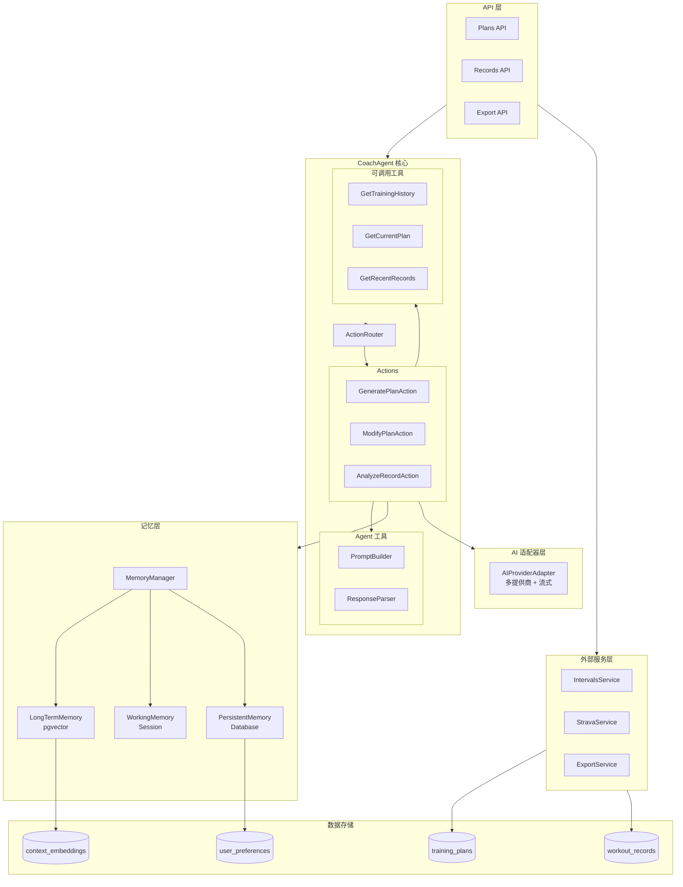
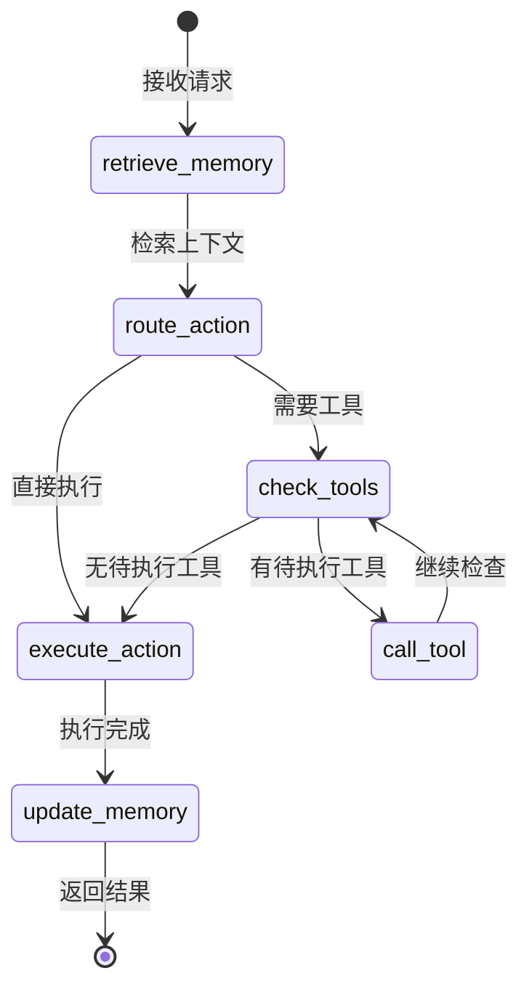
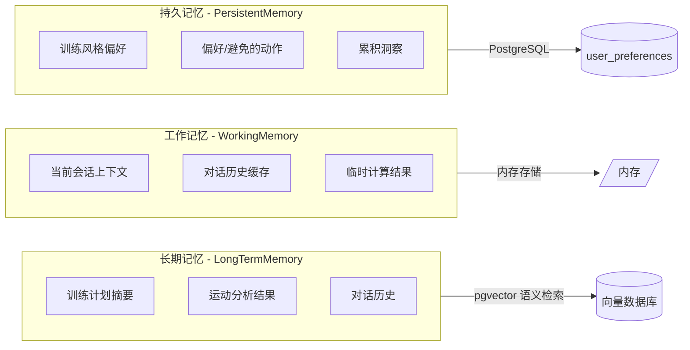
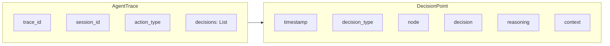

# 后端架构重构文档

> **重构日期**: 2024年12月24日  
> **重构目标**: 将双 Agent 架构统一为单一 CoachAgent，实现三层记忆管理，支持流式响应

---

## 一、重构背景

### 1.1 原有架构问题

原有架构中存在两个独立的 AI Agent：
- **PlanModificationAgent**: 负责训练计划的生成和修改
- **RecordAnalysisAgent**: 负责运动记录的分析

这种设计导致了以下问题：
1. 代码重复：两个 Agent 有大量相似的 prompt 构建和响应解析逻辑
2. 状态分散：Agent 间协调复杂，需要通过 graph.py 进行编排
3. 扩展困难：新增功能需要修改多处代码
4. 缺乏统一的记忆管理机制

### 1.2 重构目标

1. **统一 Agent**: 合并为单一的 `CoachAgent`
2. **模块化**: 将功能拆分为独立的 Action、Tool、Memory 模块
3. **三层记忆**: 实现长期记忆、工作记忆、持久记忆
4. **流式支持**: 添加 SSE 流式响应能力
5. **可扩展**: 预留外部服务接口

---

## 二、新架构设计

### 2.1 整体架构图



### 2.2 LangGraph 执行流程



### 2.3 三层记忆架构



---

## 三、目录结构变更

### 3.1 新目录结构

```
app/services/
├── agent/                          # 核心 Agent 模块
│   ├── __init__.py                # 模块导出
│   ├── coach.py                   # CoachAgent 主类 + LangGraph
│   ├── router.py                  # ActionRouter 路由器
│   ├── state.py                   # AgentState, AgentRequest, AgentResponse
│   ├── actions/                   # Action 模式实现
│   │   ├── __init__.py
│   │   ├── base.py               # BaseAction 抽象基类
│   │   ├── generate_plan.py      # 计划生成 Action
│   │   ├── modify_plan.py        # 计划修改 Action
│   │   └── analyze_record.py     # 记录分析 Action
│   └── tools/                     # Agent 工具
│       ├── __init__.py
│       ├── prompt_builder.py     # Prompt 组装
│       ├── response_parser.py    # 响应解析
│       └── callable/             # 可调用工具
│           ├── __init__.py
│           ├── training_history.py
│           ├── current_plan.py
│           └── recent_records.py
│
├── memory/                        # 记忆管理模块
│   ├── __init__.py
│   ├── manager.py                # MemoryManager 统一接口
│   ├── long_term.py              # 长期记忆（向量）
│   ├── working.py                # 工作记忆（会话状态）
│   └── persistent.py             # 持久记忆（用户偏好）
│
├── adapter/                       # AI 适配器
│   ├── __init__.py
│   └── provider.py               # 多提供商 + 流式支持
│
├── external/                      # 外部接口
│   ├── __init__.py
│   ├── intervals.py              # Intervals.icu 占位
│   ├── strava.py                 # Strava 占位
│   └── export.py                 # iCal 导出
│
├── context/                       # 向量存储（保留）
│   ├── __init__.py
│   ├── embedding.py
│   ├── manager.py
│   └── store.py
│
└── ai/                            # 向后兼容层
    └── __init__.py               # 重新导出 CoachAgent
```

### 3.2 已删除的文件

| 文件路径 | 说明 |
|---------|------|
| `services/agents/__init__.py` | 旧 agents 模块入口 |
| `services/agents/state.py` | 旧状态定义 |
| `services/agents/plan_agent.py` | 旧计划修改 Agent |
| `services/agents/analysis_agent.py` | 旧记录分析 Agent |
| `services/agents/graph.py` | 旧 LangGraph 编排 |
| `services/ai/agent_service.py` | 旧 Agent 服务封装 |
| `services/ai/adapter.py` | 旧 AI 适配器 |
| `services/ai/service.py` | 旧 AI 服务 |

---

## 四、核心组件详解

### 4.1 CoachAgent

统一的教练 Agent，使用 LangGraph 管理状态流转：

```python
class CoachAgent:
    def __init__(self, db: AsyncSession):
        self.memory = MemoryManager(db)
        self.router = ActionRouter()
        self._graph = self._build_graph()
    
    # 主要入口
    async def execute(self, request: AgentRequest) -> AgentResponse
    async def execute_stream(self, request: AgentRequest) -> AsyncIterator[str]
    
    # 便捷方法
    async def generate_plan(...)
    async def modify_plan(...)
    async def analyze_record(...)
    async def update_from_records(...)
```

### 4.2 Action 模式

每个 Action 封装特定任务的完整逻辑：

```python
class BaseAction(ABC):
    def __init__(self):
        self.prompt_builder = PromptBuilder()
        self.response_parser = ResponseParser()
    
    @abstractmethod
    async def execute(self, state: AgentState) -> AgentState
    
    async def execute_stream(self, state: AgentState) -> AsyncIterator[str]
```

三个核心 Action：
- **GeneratePlanAction**: 两阶段计划生成（宏观 + 细化）
- **ModifyPlanAction**: 自然语言计划修改
- **AnalyzeRecordAction**: 运动记录分析 + 计划更新建议

### 4.3 MemoryManager

三层记忆的统一管理接口：

```python
class MemoryManager:
    def __init__(self, db: AsyncSession):
        self.long_term = LongTermMemory(db)    # pgvector
        self.working = WorkingMemory()          # 内存
        self.persistent = PersistentMemory(db)  # PostgreSQL
    
    async def get_context(self, plan_id, query, session_id) -> RetrievedContext
    async def update(self, plan_id, session_id, update: MemoryUpdate)
```

### 4.4 AI 适配器（流式支持）

支持多个 AI 提供商和流式响应：

```python
class AIProviderAdapter(ABC):
    async def chat_completion(self, messages, temperature) -> AIResponse
    async def chat_completion_stream(self, messages, temperature) -> AsyncIterator[str]

# 具体实现
class OpenAICompatibleAdapter(AIProviderAdapter)  # OpenAI, DeepSeek
class ClaudeAdapter(AIProviderAdapter)             # Anthropic Claude
class GeminiAdapter(AIProviderAdapter)             # Google Gemini
```

---

## 五、API 变更

### 5.1 新增端点

| 方法 | 端点 | 说明 |
|------|------|------|
| POST | `/plans/{id}/chat/stream` | 流式对话修改计划 |
| GET | `/plans/{id}/export/ical` | 导出计划为 iCal 格式 |

### 5.2 现有端点变更

所有 AI 相关端点内部实现已切换为使用 `CoachAgent`：

| 端点 | 原实现 | 新实现 |
|------|--------|--------|
| `POST /plans/generate` | `AIService` | `CoachAgent.generate_plan()` |
| `POST /plans/{id}/chat` | `AgentService` | `CoachAgent.modify_plan()` |
| `POST /plans/{id}/update` | `AgentService` | `CoachAgent.update_from_records()` |
| `POST /records/{id}/analyze` | `AgentService` | `CoachAgent.analyze_record()` |

---

## 六、数据库变更

### 6.1 新增表

```sql
CREATE TABLE user_preferences (
    id UUID PRIMARY KEY DEFAULT gen_random_uuid(),
    plan_id UUID REFERENCES training_plans(id) ON DELETE CASCADE,
    preference_key VARCHAR(50) NOT NULL,
    preference_value JSONB NOT NULL DEFAULT '{}',
    created_at TIMESTAMP DEFAULT NOW(),
    updated_at TIMESTAMP DEFAULT NOW(),
    UNIQUE(plan_id, preference_key)
);

CREATE INDEX idx_user_preferences_plan_id ON user_preferences(plan_id);
CREATE INDEX idx_user_preferences_key ON user_preferences(preference_key);
```

### 6.2 预定义偏好键

```python
class PreferenceKey:
    TRAINING_STYLE = "training_style"        # 训练风格
    PREFERRED_EXERCISES = "preferred_exercises"  # 偏好动作
    AVOIDED_EXERCISES = "avoided_exercises"  # 避免动作
    BEST_TRAINING_DAYS = "best_training_days"  # 最佳训练日
    RECOVERY_SPEED = "recovery_speed"        # 恢复速度
    ACCUMULATED_INSIGHTS = "accumulated_insights"  # 累积洞察
```

---

## 七、向后兼容性

### 7.1 保留的导入路径

为确保现有代码不受影响，保留了以下导入路径：

```python
# 旧路径（仍可用）
from app.services.ai import AIService, AgentService

# 新路径（推荐）
from app.services.agent import CoachAgent
from app.services.adapter import get_ai_adapter
from app.services.memory import MemoryManager
```

### 7.2 兼容层实现

```python
# app/services/ai/__init__.py
from app.services.agent import CoachAgent

# 向后兼容别名
AIService = CoachAgent
AgentService = CoachAgent
```

---

## 八、外部服务预留

### 8.1 Intervals.icu 接口

```python
class IntervalsService:
    async def sync_activities(self, athlete_id: str) -> List[Dict]
    async def push_workout(self, athlete_id: str, workout: Dict) -> str
    async def get_athlete_profile(self, athlete_id: str) -> Dict
    async def get_wellness_data(self, athlete_id, start_date, end_date) -> List[Dict]
```

### 8.2 Strava 接口

```python
class StravaService:
    async def get_authorization_url(self, redirect_uri: str) -> str
    async def exchange_token(self, code: str) -> Dict
    async def get_athlete(self, access_token: str) -> Dict
    async def get_activities(self, access_token, after, before, per_page) -> List[Dict]
```

### 8.3 导出服务

```python
class ExportService:
    def export_to_ical(self, plan_data, start_date, calendar_name) -> str
    def get_ical_content_type(self) -> str
    def get_ical_filename(self, plan_id: str) -> str
```

---

## 九、使用示例

### 9.1 生成训练计划

```python
from app.services.agent import CoachAgent

agent = CoachAgent(db)
result = await agent.generate_plan(
    user_profile={"goal": "增肌", "level": "初级", ...},
    start_date="2024-12-24"
)

if result.success:
    plan = result.plan
    weeks = result.updated_weeks
```

### 9.2 流式对话修改

```python
from app.services.agent import CoachAgent, AgentRequest, ActionType

agent = CoachAgent(db)
request = AgentRequest(
    action=ActionType.MODIFY_PLAN,
    plan_id="xxx",
    plan_data={"weeks": [...]},
    user_message="把第一周的强度降低一些",
    stream=True
)

async for chunk in agent.execute_stream(request):
    print(chunk, end="")
```

### 9.3 分析运动记录

```python
result = await agent.analyze_record(
    plan_id="xxx",
    record_id="yyy",
    record_data={"type": "力量训练", "duration": 60, "rpe": 7}
)

if result.suggest_update:
    print(f"建议调整计划: {result.update_suggestion}")
```

---

## 十、Agent 决策可解释性日志

### 10.1 概述

为了提高 Agent 行为的透明度和可调试性，实现了完整的决策日志系统。该系统记录 Agent 在执行过程中的每个决策点，包括：

- **请求接收**: 初始请求的解析和理解
- **记忆检索**: 从三层记忆中检索了什么上下文
- **动作路由**: 为什么选择特定的 Action
- **工具检查**: 需要调用哪些工具
- **工具调用**: 工具调用的结果
- **动作执行**: Action 的执行结果
- **记忆更新**: 更新了哪些记忆层
- **响应生成**: 最终响应的生成

### 10.2 决策日志架构



### 10.3 决策类型

| 类型 | 节点 | 说明 |
|------|------|------|
| `request_received` | entry | 接收并解析请求 |
| `memory_retrieved` | retrieve_memory | 从记忆中检索上下文 |
| `action_routed` | route_action | 路由到特定 Action |
| `tool_check` | check_tools | 检查需要的工具 |
| `tool_called` | call_tool | 调用工具并获取结果 |
| `action_executed` | execute_action | 执行 Action |
| `memory_updated` | update_memory | 更新记忆层 |
| `response_generated` | exit | 生成最终响应 |
| `error_occurred` | error | 发生错误 |

### 10.4 配置方式

在 `.env` 文件中启用：

```bash
# 启用 Agent 决策日志（详细追踪）
AGENT_DECISION_LOG=true

# 也可以使用 AI_DEBUG_LOG 同时启用 AI 调用日志和决策日志
AI_DEBUG_LOG=true
```

### 10.5 日志输出示例

```json
{
  "event": "Agent trace completed",
  "trace_id": "abc123def456",
  "session_id": "sess-789",
  "plan_id": "plan-456",
  "action_type": "modify_plan",
  "total_duration_ms": 2345.67,
  "success": true,
  "decision_count": 6,
  "memory_retrieved": true,
  "tools_called": [],
  "ai_calls_count": 1
}
```

决策流日志：
```json
{
  "event": "Agent decision flow",
  "trace_id": "abc123def456",
  "flow": "entry(Processing modify_plan) -> retrieve_memory(Retrieved context) -> route_action(modify_plan) -> execute_action(Executed modify_plan) -> update_memory(Updated conversation, plan_context) -> exit(Success)"
}
```

### 10.6 代码使用示例

```python
from app.core.logging import AgentDecisionLogger, DecisionType

logger = get_logger(__name__)
decision_logger = AgentDecisionLogger(logger)

# 在 Agent 执行中使用
with decision_logger.trace(session_id, plan_id, action_type) as trace:
    # 记录决策
    trace.log_decision(
        DecisionType.ACTION_ROUTED,
        "route_action",
        decision="modify_plan",
        reasoning="User message contains plan modification request"
    )
    
    # 记录记忆检索
    trace.log_memory_retrieval(
        has_long_term=True,
        has_preferences=True,
        context_length=1500,
        query="调整第一周强度"
    )
    
    # 获取人类可读的解释
    explanation = trace.get_explanation()
    print(explanation)
```

### 10.7 生成的解释示例

```markdown
## Agent Execution Trace (abc123def456)

**Action**: modify_plan
**Duration**: 2345.67ms
**Status**: ✅ Success

### Decision Flow

1. **entry** (request_received)
   - Decision: Processing modify_plan
   - Reasoning: Modify request: 把第一周的强度降低一些
   - Duration: 0.12ms

2. **retrieve_memory** (memory_retrieved)
   - Decision: Retrieved context
   - Reasoning: Searched for: '把第一周的强度降低一些' -> Found 1500 chars of context
   - Duration: 45.23ms

3. **route_action** (action_routed)
   - Decision: modify_plan
   - Reasoning: User message with existing plan -> modify plan through chat
   - Duration: 0.05ms

4. **execute_action** (action_executed)
   - Decision: Executed modify_plan
   - Reasoning: 4 weeks updated | Response: 256 chars
   - Duration: 2100.45ms

5. **update_memory** (memory_updated)
   - Decision: Updated conversation, plan_context
   - Reasoning: Storing results for future context retrieval
   - Duration: 89.12ms

6. **exit** (response_generated)
   - Decision: Success
   - Reasoning: 4 weeks updated | Message: 已为您调整了第一周的训练强度...
   - Duration: 0.08ms
```

---

## 十一、后续规划

### 11.1 待实现功能

- [ ] Intervals.icu 完整集成
- [ ] Strava OAuth 集成
- [ ] 更多导出格式（PDF、Excel）
- [ ] 多用户支持

### 11.2 优化方向

- [ ] 引入 Redis 作为工作记忆后端
- [ ] 添加记忆压缩和摘要机制
- [x] ~~实现 Agent 决策的可解释性日志~~ ✅ 已完成

---

## 附录：Git Commit Message

```
refactor: unify AI agents into single CoachAgent with LangGraph

- Consolidate PlanModificationAgent and RecordAnalysisAgent into CoachAgent
- Implement three-layer memory: long-term (pgvector), working (session), persistent (DB)
- Add Action pattern: GeneratePlanAction, ModifyPlanAction, AnalyzeRecordAction
- Add streaming response support for chat endpoints
- Add iCal export functionality
- Create external service placeholders (Intervals.icu, Strava)
- Add UserPreference model for persistent memory
- Add agent decision explainability logging (AgentDecisionLogger)
- Remove old agents/, ai/service.py, ai/agent_service.py, ai/adapter.py
```

